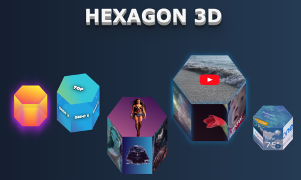
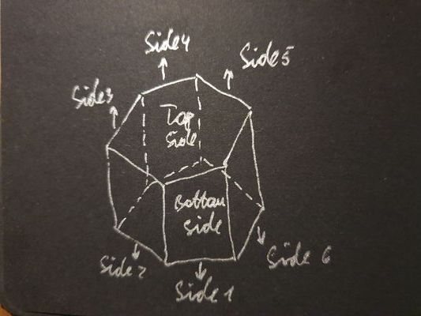

# hexagon-3d-react
A React based component wrapper for the [<b>hexagon-3d</b>](https://www.npmjs.com/package/hexagon-3d) service. Hexagon-3d providing styles object for CSS-based 3d hexagons with high interactivity capabilities. You may use these shapes as skeletons for various animations, images adding, videos playing, combining them into different forms, and doing a lot of other things. The capabilities of hexagons will be growing over time.

## Installation

`npm install hexagon-3d-react`

## Usage

`import Hexagon3D from 'hexagon-3d';`

or 

`const Hexagon3D = require('hexagon-3d').default`;

After importing hexagon service is ready to be used as a regular React component:

`render (<Hexagon3D <parameters>>)`;

### Example of usage

    `<Hexagon3D
        width={130}
        height={150}
        rotateZ={20}
        rotateX={40}
        growTop={true}
        topChildren={<h1>Top</h1>}
        side1Children={<h1>Side1</h1>}
        side2Children={<h1>Side2</h1>}
        side3Children={<h1>Side3</h1>}
        side4Children={<h1>Side4</h1>}
        side5Children={<h1>Side5</h1>}
        side6Children={<h1>Side6</h1>}
    />`
    
  ### Parameters
  
| Name           | Type           | Description                                                                                                  | Values      |
|----------------|----------------|--------------------------------------------------------------------------------------------------------------|-------------|
| width          | number         | Width of the hexagon (the biggest distance of it's 2 opposite points)                                        | any         |
| height         | number         | Height of the hexagon sides                                                                                  | any         |
| rotateZ        | number         | Rotation degrees round Z axis                                                                                | 0-360       |
| rotateX        | number         | Rotation degrees round X axis                                                                                | 0-360       |
| showShadow     | boolean        | Flag to indicate whether faces border shadow should be shown (default - false)                               | true, false |
| shadowColor    | string         | Color of a faces border shadow                                                                               | any         |
| growTop        | boolean        | Flag which indicates how hexagone should change it's height - to the top or to the bottom. (default - false) | true, false |
| topBottomColor | string         | Color of hexagon top and bottom sides                                                                        | any         |
| sidesColor     | string         | Color of hexagon sides                                                                                       | any         |
| opacity        | number         | Opacity of hexagon sides                                                                                     | 0.0 - 1.0   |
| showTransition | boolean        | Indicate whether height change animation should be shown (default - false)                                   | true, false |
| topChildren    | HTML, string   | HTML element or string which will be placed on the top side of the hexagon                                   | any         |
| side1Children  | HTML, string   | HTML element or string which will be placed on the side 1* of the hexagon                                    | any         |
| side2Children  | HTML, string   | HTML element or string which will be placed on the side 2* of the hexagon                                    | any         |
| side3Children  | HTML, string   | HTML element or string which will be placed on the side 3* of the hexagon                                    | any         |
| side4Children  | HTML, string   | HTML element or string which will be placed on the side 4* of the hexagon                                    | any         |
| side5Children  | HTML, string   | HTML element or string which will be placed on the side 5* of the hexagon                                    | any         |
| side6Children  | HTML, string   | HTML element or string which will be placed on the side 6* of the hexagon                                    | any         |
| bottomChildren | HTML, string   | HTML element or string which will be placed on the bottom side of the hexagon                                | any         |
  
  *Hexagon sides direction:
  
  
  
  ### Next iterations
  
  * Add tooltips for each side
  * Add more styling capabilities
  * Add rotations and other animation effects
  * Add deeper sides interactions
  * Optimize CSS properties